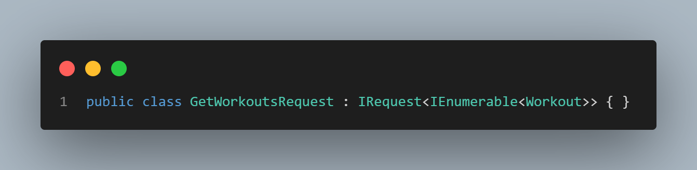

### Minimal APIs

Minimal APIs are a great way to build a powerful .NET API fast. They reduce the time taken to get your API up and running which is great for simple APIs or even prototyping a new feature or product.

Let’s have a look at a very simple minimal API. 

The code we want to focus on is the `app.MapGet()` method. The method name tells us that this method is responsible for HTTP `GET` requests. The first parameter is the URL pattern we need to match to serve this request and execute the delegate provided in the second parameter.

For the logic within the delegate we are simply building a simple collection of workouts and returning them. This is fine for a minimal API but what happens if we want to start adding more logic and more endpoints - the `Program` class will soon start filling up and become quite convoluted.

This code completely removes the need to create controllers in your API project, reducing the time to get your endpoints created.

### Injecting Dependencies

Dependency injection is a common pattern in software development. Abstractions have corresponding concrete implementations registered within a IoC container at startup. These abstractions can then be injected to a class via the constructor and the IoC container will determine the how to resolve the dependency based on the abstraction/concrete mapping. This makes the code more modular and easier to update. 

We will start by moving some of the logic out into other classes and utilizing dependency injection to inject dependent classes into the minimal API controller.

Let's break down what's happening here. We have created a new class called `WorkoutRepository` that inherits from the interface `IWorkoutRepository` and we have registered this with our container as a singleton. 

We have also updated the minimal API delegate by passing through the `IWorkoutRepository` interface. This will resolve to the concrete implementation we registered with the container.

As you can see this has made the code cleaner but even with breaking the logic out into classes, the minimal API controllers have the potential to get out of hand once we start introducing more logic that require more dependencies.

### Mediatr

Mediatr is a popular library that allows you to implement the mediator pattern with ease. If you are unfamiliar with the mediator pattern you can read more here.

Simply put, the mediator pattern has a mediator class. There will also be a number of mediator request classes that are registered to a mediator handler. When the mediator request is passed to the mediator class, the mediator class knows which request handler to use.

After installing the latest version of the MediatR package we will first need to define our MediatR request. Here we have the `GetWorkoutsRequest`:

It's very simple defining a request in MediatR, we create the class and then inherit from the IRequest class. The generic type argument we pass through is the response type.

Next, we will define a handler for this request type. The logic within the handler will be very simple - we will inject our `IWorkoutRepository` and use this to fetch the workouts from the data source and return them. Below is the code for the Mediatr request handler.

Here is a simple implementation of Mediatr in our minimal API: 

The only thing we must do to use Mediatr is inject the IMediatr dependency into our delegate. We then pass the `GetWorkoutsRequest` request class to the Mediatr object. Mediatr then works out what handler to use based on the `IRequestHandler` with the `GetWorkoutsRequest` as the generic argument. 

When we execute this, the `GetWorkoutsRequestHandler` will execute the `Handle` method and our API endpoint will return the result.

