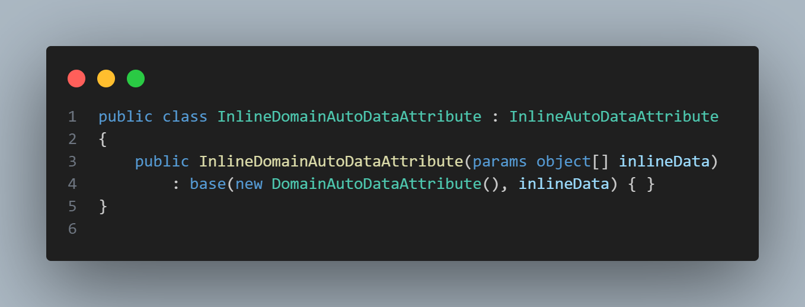

### XUnit and Autofixture

Unit testing is an essential part of any software development, but one of the biggest slowdowns is the time it takes to setup the test data. This can be helped by using Autofixture to handle a lot of the test data generation.

Let’s have a look at an example unit test with manual data setup. Note that we will be using Moq as our mocking library for these tests, but Autofixture provides integrations with several mocking frameworks.

We spend a lot of time setting up the data, even when the data may not be necessary for the specific test that we are running. Let’s refactor the test to utilise Autofixture.

First we need to install the Autofixture Nuget package. Once this has been added, we can initialise a new `Fixture` in our testing class. This fixture will be used to generate our anonymous objects. We can use the `Fixture.Create<T>()` method to generate the object we need. So to generate a random string we can use ` Fixture.Create<string>()`. 

We have saved a few lines of code and made the test easier to read.

We can further improve this code by using Autofixture to generate our mock classes. We can do this by adding a customization to the Fixture specifically for Moq. First, we need to install the package `AutoFixture.AutoMoq`. We can then use the Customize method when initializing the Fixture class to add the `AutoMoqCustomization`. 

Now we have this customization, we can “freeze” the mocked instance of the class. By freezing, we ensure we pull the one instance of the object.

Let’s take this one step further and create an Attribute class derived from the `AutoDataAttribute` class provided by Autofixture. The `AutoDataAttribute` class allows us to pass anonymous generated objects into the method, however this doesn’t include the `AutoMoqCustomization` hence the need to create a new class that initializes the fixture with the ` AutoMoqCustomization`. 

Now we can use this attribute and pass the generated objects into the test method. 

As you can see, we have cleaned up the test above and reduced the noisy creation of objects that do not concern the test. This makes the test easier to read and more maintainable. 

One of the things we might want to do during the data setup is apply a certain rule for certain classes. For instance, we may want to only create workouts with a created date in the past as this matches our domain logic. We can do this by creating our own class derived from `ICustomization`. 

Here, we are simply registering a rule where all auto generated workouts will have a `Date` property set to 7 days ago from now. We then just need to register this customization on the constructor of our `AutoMoqDataAttribute` alongside the `AutoMoqCustomization`. 

Another thing we want to include is a combination of auto generated data and manual data when running tests.

We can do this by creating a new class that derived from the `InlineAutoDataAttribute` provided by Autofixture. The constructor of this class will need to take an array of objects that can be passed through as test data. We then pass through our `DomainAutoDataAttribute` and the list of objects to the base constructor.

Now we have this in place, we can use this attribute just as we did the `DomainAutoDataAttribute ` however now we can specify parameters to pass through to the test. Note that the inline data should always be before the auto generated parameters when defining the method signature.

Hopefully Autofixture will help make your unit tests easier to write and maintain.