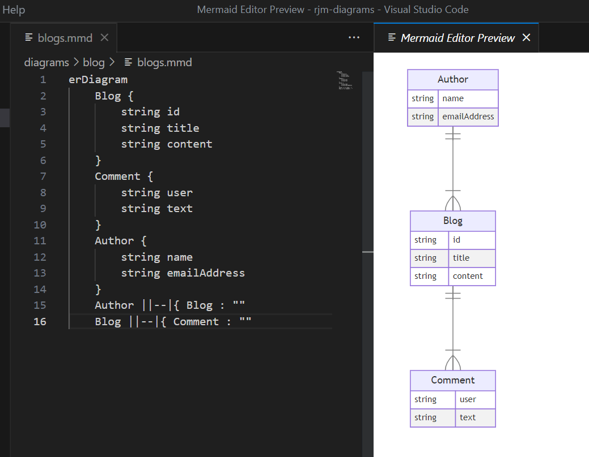
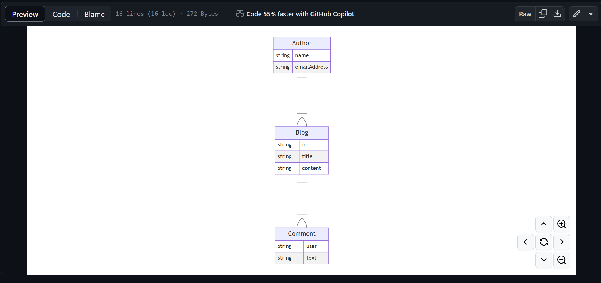
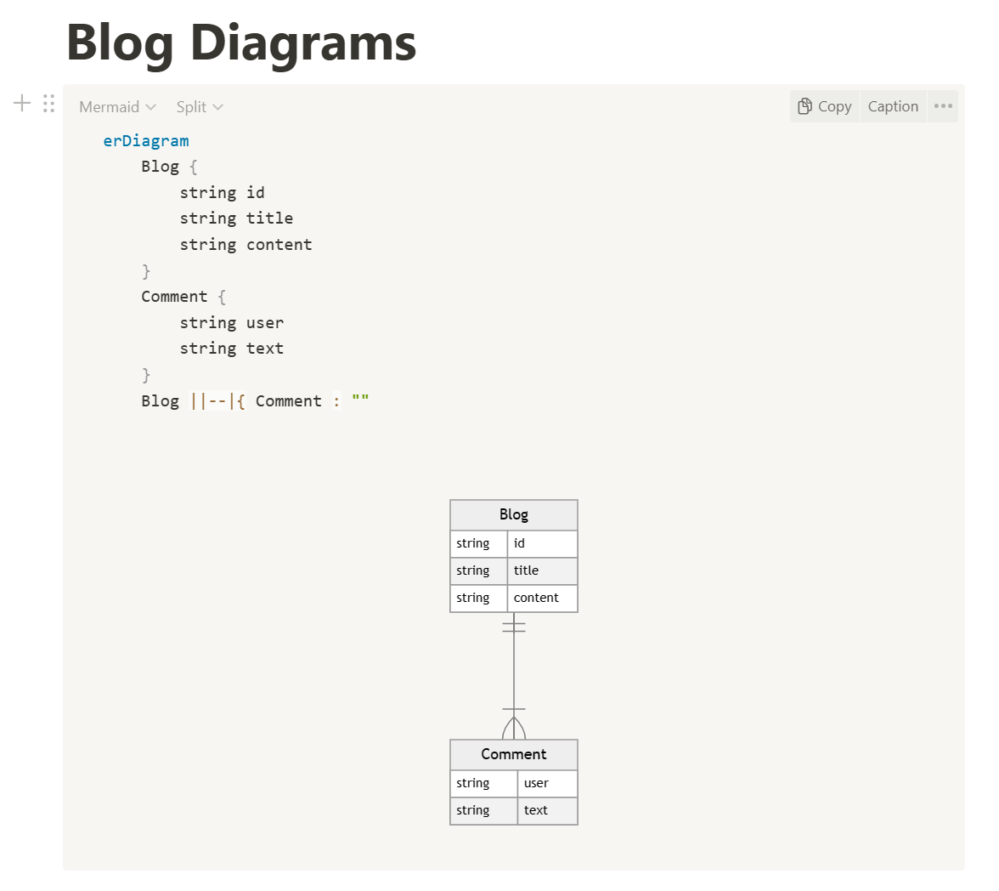

We all know that great planning is key to the success of a software project and good diagrams are synonymous with this. Finding diagramming tools can often be overwhelming with the sheer number of options available.  

I have recently been using MermaidJS for my various diagramming needs. The syntax is simple (as it is Javascript based) and a wide variety of diagram types are available, from entity relationship diagrams to C4 diagrams.

When using a diagramming tool that is code based, you often need to generate the visual diagram from the code. If you use Visual Studio Code, you can generate the diagram as you’re editing the code by downloading the extension Mermaid Editor by tomoyukim. This is a great extension that allows you to preview your MermaidJS diagrams side by side with the code.

The real time updates improve the efficiency of the diagramming process and allow you to validate the diagram view as you're writing the code.

VS Marketplace Link: https://marketplace.visualstudio.com/items?itemName=tomoyukim.vscode-mermaid-editor 

One of features I look for when comparing different diagram tooling is the ability to host a rendered version of diagrams easily. When hosting your MermaidJS diagrams in a GitHub repository you can view the diagrams when exploring the repository. This is a neat little feature which makes it easy to access your diagrams wherever you’re working. The pan and zoom tools are a bonus feature that let you drill into the relevant parts of the diagrams with ease.

Another neat integration is with Notion. Simply use the `/` command key and search for MermaidJS command. You can then edit your diagrams in your notebook. Again this integration updates in real time and can live side by side with your existing Notion documents.

This is just scratching the surface with the MermaidJS integrations. Head over to the MermaidJS site and view the docs to see the possibilities - https://mermaid.js.org/ecosystem/integrations-community.html.