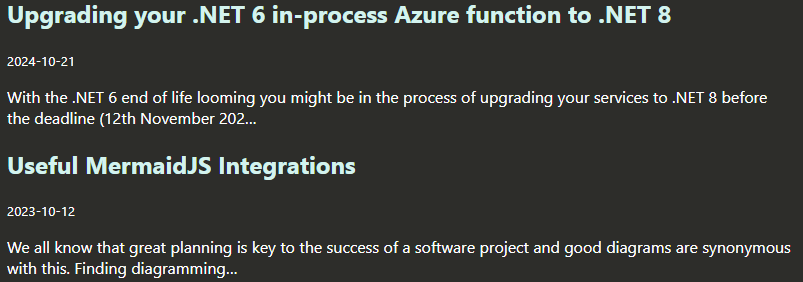
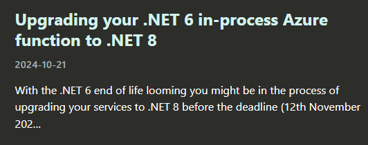
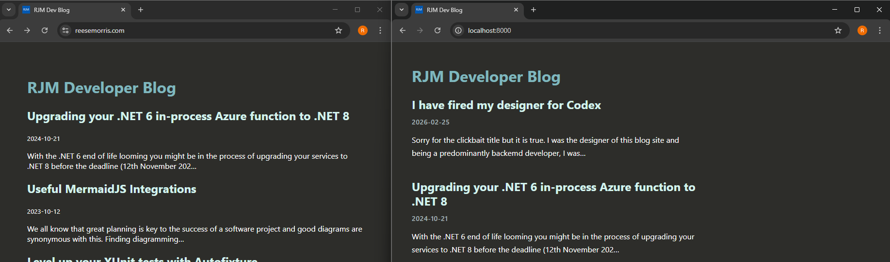
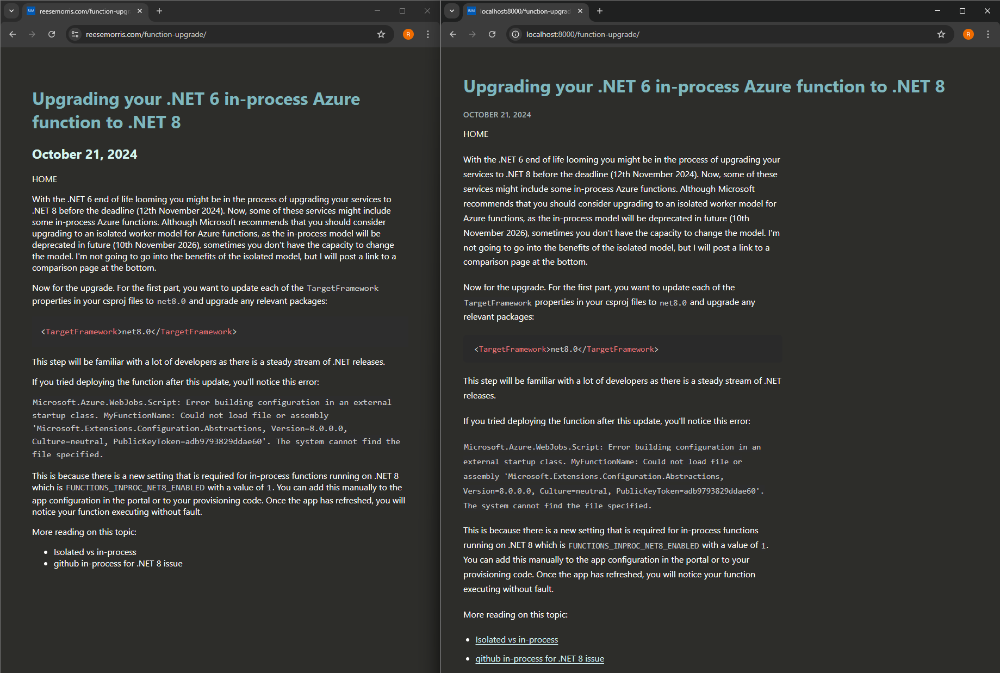

### Context

Sorry for the clickbait title, but it is true. I was the designer of this blog site and, as a predominantly backend developer, I was terrible at it (evidently).

When I first created this blog site a couple of years ago, I was determined to design everything from scratch, using no templates and minimal helper libraries. However, that approach created a plain-looking site with no character. While it is quick to load and responsive, it does not reflect what I wanted this blog to be.

I have recently been building a lot with Codex, and I thought it would be the perfect time to use it to clean up the blog site. Below is a breakdown of the steps I used to analyze and improve the site.

### Tools used

- Codex CLI model gpt-5.3-codex medium
- [Chrome dev tools MCP](https://github.com/ChromeDevTools/chrome-devtools-mcp/)
- VS Code

### Process

Ensure the local site is running so analysis can be done on a local instance of the site. Important - every time you're using MCPs or skills verify what you're installing and make sure you understand what's happening on your machine.

Open the terminal and run Codex CLI: `codex -a on-request --sandbox workspace-write`

Once running, ask Codex to analyze the blog site. I am using the Chrome DevTools MCP because I want the agent to open Chrome and run analysis through MCP. This gives us greater depth than only analyzing code for design choices.

Here is the prompt I used:

`my blog site is running at http://localhost:8000/ can you use the chrome mcp to analyze the design of the site?`

As you can see, this is a very simple prompt. Let's see how Codex handles it.

While the agent is working, you will see the browser opening and navigating through each page. This is what the Chrome MCP enables. Once the agent has finished analyzing, I was presented with the output:

```
I analyzed your site in Chrome MCP (/, /function-upgrade/, /agentic-designer/) on desktop and mobile.

  What's working

  - Clear, minimal layout with strong readability.
  - Good contrast on a dark background (approx ratios: body text 13.81, H2 11.72, H1 6.2), so legibility is solid.
  - Semantic heading structure is clean (h1 for page title, h2 for post titles/dates).
  - Responsive behavior is stable; content reflows cleanly on narrow screens.

  Main design issues

  1. Weak visual hierarchy between metadata and content.

  - Dates and body copy compete too closely in size/weight.
  - Homepage entries blend together because each post block has similar visual weight.

  2. Reading rhythm is flat.

  - Paragraphs use line-height: normal (~too tight for long-form reading).
  - Long text blocks would benefit from higher line-height and clearer vertical spacing patterns.

  3. Link affordance is inconsistent.

  - Links are mostly non-underlined (a:link has text-decoration: none), so clickability relies on context.
  - Hover color jumps to hot pink, which feels off-brand relative to your cyan/white palette.

  4. Width/layout control is loose.

  - Main content has no explicit max-width rule (computed max-width: none, current width ~784px by layout).
  - This can drift across templates/devices and hurt consistency.

  High-impact fixes (in order)

  1. Set a consistent content container:

  - max-width: 72ch for article text, with padding-inline: clamp(16px, 4vw, 32px).

  2. Improve type scale/rhythm:

  - Body line-height: 1.6-1.75.
  - Add a clearer spacing system (--space-1..--space-6) and apply it consistently between title/date/excerpt.

  3. Strengthen post-list scanning:

  - Style each post preview as a distinct block (subtle divider or card spacing).
  - Make date smaller/dimmer and keep title as the dominant element.

  4. Normalize link UX:

  - Keep brand-consistent hover/focus states.
  - Add underlines for inline links in article bodies; keep title links distinct but clearly interactive.

  5. Add explicit focus styling:

  - You currently have browser default focus visible (good), but define a custom :focus-visible ring for consistency.

  If you want, I can implement a concrete CSS pass for these changes directly in your theme files next.
```

I do like the "What's working" section, but you can tell from the original output that I am a backend developer by nature. Let's break down the issues.

### Issue 1 - Weak visual hierarchy between metadata and content.

This is a valid point, but it had been invisible to me until now. Below is a screenshot where the date gets lost against the post snippet. Let's fix that.



Let's ask Codex to create a plan for fixing issue 1. We are asking for a plan first because we want to verify the changes before they are made. If you only want to create plans, Codex can be run in plan mode by executing the `plan` command.

Prompt used: `Can we plan for fixing 1. Weak visual hierarchy between metadata and content?`

The plan can be seen below.

```
Scope

  1. Define metadata and content tokens in src/pages/index.css.

  - Add variables for hierarchy:
      - --color-title, --color-body, --color-meta
      - --fs-meta, --lh-meta, --fw-meta
      - --space-title-meta, --space-meta-body, --space-post-gap
  - Use a visibly dimmer metadata color (still accessible) and smaller size.

  2. Add explicit post-list structure in src/pages/index.tsx.

  - Wrap each post with semantic classes:
      - <article className="post-card">
      - Title link: .post-title-link / .post-title
      - Date: <small className="post-meta">
      - Excerpt: <p className="post-excerpt">
  - This gives CSS precise control over hierarchy without changing content.

  3. Style post hierarchy in src/pages/index.css.

  - .post-title remains dominant (size/weight/color).
  - .post-meta becomes clearly secondary:
      - smaller font
      - lower contrast color
      - medium weight or normal weight
      - slight letter-spacing
  - .post-excerpt stays body-priority but below title:
      - standard body color
      - consistent line-height
  - Enforce spacing rhythm:
      - title -> meta (tight)
      - meta -> excerpt (medium)
      - post -> next post (large)

  4. Align article-page metadata treatment in src/pages/{markdownRemark.frontmatter__slug}.jsx.

  - Add classes to title/date/home/content wrapper.
  - Use same metadata style token for date (.post-meta) so list/detail pages feel consistent.

  5. Validate in Chrome MCP (desktop + mobile).

  - Confirm quick scan behavior:
      - title is first visual stop
      - date is identifiable but not competing
      - excerpt reads as supporting content
  - Confirm no regressions in spacing, wrapping, or readability.

  Acceptance criteria

  1. Date is visually subordinate to both title and excerpt.
  2. Each post in the index scans as a distinct unit.
  3. Index and article pages use consistent metadata styling.
  4. Works at 1280x1024 and 390x844 without overlap or crowding.

  If you want, I'll implement this plan now.
```

The plan steps are concise and clear. In addition to code changes, it proposes a validation step. As you can see, we are validating through Chrome MCP.

Let's get Codex to implement the changes by simply responding "yes."

The update looks great. The metadata on the post listing is now distinct from the content preview.



I followed a similar process for each of the other issues reported by Codex. The plans were all structured in the same way, and the process remained consistent. I did not have to provide additional information or request changes. I do not want to fill this page with prompts and plans for every issue, so I will provide comparisons in the outcome section to show the full extent of the changes.

### Outcome

Overall, I am happy with the results. During manual testing, there was one design choice I did not like (the content container did not look wide enough), but the site is in a much better state, design-wise, than when we started.

The fact that this was achieved with one prompt plus a readily available MCP is what makes this great.

I am not committing the design changes in this post because I want to create a video to demonstrate them, but I will leave a side-by-side comparison below of what could have been.

Issues Fixed:
- Weak visual hierarchy between metadata and content.
- Reading rhythm is flat.
- Link affordance is inconsistent.
- Width/layout control is loose.

Comparisons (Updated versions are on the right):




