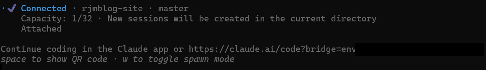
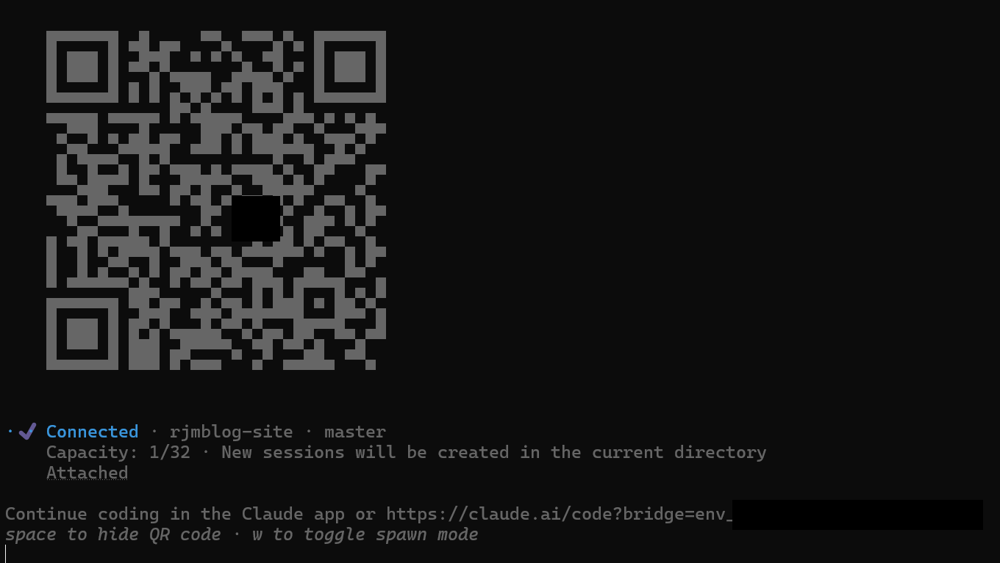
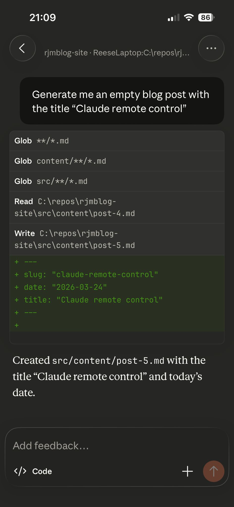

I feel the need to mention that none of the writing in this blog post is AI generated, however the empty post was initialised on my phone.

Around a month ago Claude released remote control which enables you to control a Claude code session running on your PC. This proves super useful if you need to step away from the desk but want your agent to continue running tasks or need to approve any actions.

The initial release was very buggy and it was very difficult to retain a connection but after the latest updates the reliability has improved significantly and now you can reliably maintain a long session with big code updates.

### Claude remote control setup

Claude remote control couldn't be simpler to setup. Make sure you have updated the Claude CLI to the latest version and run `claude remote-control`.

On first run you will need to enable the remote control after you have done this, you will have an option of two different spawn modes:

```
Spawn mode for this project:
  [1] same-dir — sessions share the current directory (default)
  [2] worktree — each session gets an isolated git worktree
```
You should pick a spawn mode based on the use case of your current remote control session. If you plan to work on the same feature with one or many remote devices you should pick option 1. If you plan to work on separate features across many devices option 2 using worktrees would suit your needs better. 

Once you have selected an option, the session will start and you will see a URL that you can use to connect to the session or you can press spacebar reveal a QR code you can scan to join on your phone.





That is all the setup required.

You once you are on your device you can send prompts, see replies and approve any elevated access requests.

Here is an example:



### My use cases

For me personally, the biggest benefit of this functionality will be approving request from Claude on  long running tasks whilst I have stepped away from my desk. It's great to set an agent off at lunchtime to do a task or even utilise an end of day agent but it can be frustrating when you return to your desk to find out the agent got stuck after 1 minute. 

The remote can also be utilised for smaller tasks such as a small bug fix or improving some test coverage. The code still needs to be reviewed and verified and for bigger tasks this would be extremely difficult on a mobile device. 

Whatever your use case is for Claude remote control I hope you find this post useful.